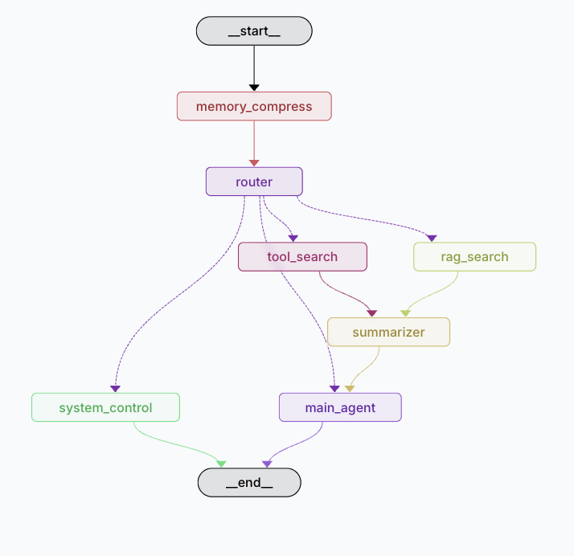

# QTrobot AI Assistant: A Decoupled Cyber-Physical Framework for Intelligent Social Robotics

This repository presents the advanced computational architecture designed for the QT social robot. The system employs a decoupled, asynchronous microservice paradigm to seamlessly integrate traditional robotic control (via ROS) with state-of-the-art Large Language Models (LLMs) and physiological signal processing. The resulting framework achieves a **bipartite intelligent architecture**, facilitating multimodal voice interaction, real-time global knowledge retrieval, localized specialized domain query resolution (via Retrieval-Augmented Generation), and high-frequency electrocardiogram (ECG) telemetry visualization, all synchronized with dynamic physical actuation.

---

## 1. System Architecture and Core Components

The framework is predicated upon a **Decoupled Asynchronous Architecture**, completely isolating high-latency cognitive computations from real-time hardware kinematics using ZeroMQ for inter-process communication (IPC) with minimal latency overhead:



### 1.1 Cognitive Processing Layer (Python 3.11 + LangGraph)
- **State-Driven Agentic Workflow**: Utilizes LangGraph to implement a deterministic state machine equipped with a semantic routing engine to accurately classify user natural language intent.
- **Dynamic Topographic Search**: Actuates the **Google Serper API** (implemented via `GoogleSerperAPIWrapper`) for real-time extraction of transient global information, functioning as a fallback heuristic when localized knowledge is insufficient.

### 1.2 Kinematic & Sensory Actuation Layer (Python 3.7 + ROS 1)
- **Acoustic Processing (NVIDIA Riva)**: Operates a real-time Automatic Speech Recognition (ASR) pipeline. It functions as a persistent environmental auditory listener, dispatching robust textual transcripts to the downstream cognitive layer.
- **Behavioral Dispatcher**: Computes JSON payloads originating from the cognitive layer (`Port 5556`) to articulate `/qt_robot/gesture/play`, audio synthesis, and facial expressions via native ROS Service calls, enabling synchronized multi-modal articulation.

### 1.3 Physiological Telemetry Interface (Python + HTML5/WebSockets)
- **High-Frequency ECG DSP Pipeline**: Interfaces with microcontrollers (e.g., ESP32 via SPI) to extract raw logic signals. Applies multistage digital signal processing (CIC, FIR, and bandpass superfilters) alongside fixed-point quantization for medical-grade waveform fidelity.
- **Asynchronous Clinical Visualization**: Deploys a lightweight WebSocket server streaming down-sampled vectors to a hardware-accelerated HTML5 Canvas dashboard, ensuring high-throughput, flicker-free rendering decoupled from the robotic core computations.

---

## 2. Repository Topology

```text
QT_ai_assistant/
│
├── ai/                      # Cognitive Processing Layer (Isolated Exec. Env: Python 3.11)
│   ├── document/            # Unstructured corpora (.txt) for the RAG embedding pipeline
│   ├── src/                 # Topological LangGraph definition and semantic routing logic
│   └── requirements.txt     # Specialized dependencies (Langchain, FAISS, ZMQ)
│
├── ros/                     # Kinematic Actuation Layer (Native ROS 1 / Python 3.7)
│   ├── src/
│   │   ├── riva_speech_recongnition.py # Acoustic ingestion node
│   │   └── ros_behavior_dispatcher.py  # Spatial and affective articulation engine
│
├── ecg/                     # Physiological Telemetry Interface
│   ├── src/                 # DSP algorithms (Filter, Quantization, R-Peak Detection)
│   ├── web/                 # WebSocket Server (ecg_server.py) and Clinical Dashboard
│   └── requirements.txt     # Numeric computation dependencies (NumPy, SciPy)
│
├── scripts/                 # System orchestration and integration tests
│   ├── run.sh               # Main orchestrator utilizing asynchronous port polling
│   └── ...                  # Unit and integration test suites
│
└── README.md
```

---

## 3. Deployment Methodology

An automated orchestration script (`run.sh`) is provided to execute the distributed topology. It utilizes a polling heuristic to ensure strictly ordered, collision-free initialization of interdependent services.

### 3.1 Prerequisite Configuration
- Ensure the **NVIDIA Riva Core Server** daemon is active and systematically exposed on port `50051`.
- Instantiate virtual environments for isolated modules (`ai` and `ecg`) leveraging their respective `requirements.txt` manifests.
- Populate the `ai/document` directory with proprietary textual data to initialize the localized semantic vector space.

### 3.2 System Initialization
Execute the primary orchestration sequence:
```bash
./scripts/run.sh
```

**Asynchronous Bootstrapping Sequence**:
1. **[0/4] Riva Core Verification**: Validates GPU allocation and confirms RPC port binding for the speech engine.
2. **[1/4] ROS Actuation Binding**: Instantiates the behavioral node, establishing a ZeroMQ subscriber socket on `5556`.
3. **[2/4] ASR Transceiver Initiation**: Activates continuous acoustic monitoring to intercept ambient vocalizations.
4. **[3/4] Cognitive Engine Deployment**: Compiles the LangGraph state machine and FAISS dense indices, opening publisher protocols on `5555`.

### 3.3 Dynamic Knowledge Ingestion Paradigm
The system integrates an auto-indexing FAISS mechanism designed for **hot-state initialization**. Upon executing `./scripts/run.sh`, the framework performs comprehensive traversal of `ai/document/**/*.txt`, executing robust tokenization and high-dimensional vector embeddings straight into volatile memory. This eliminates the necessity for manual retraining or explicit database migrations when updating the domain-specific corpus.
