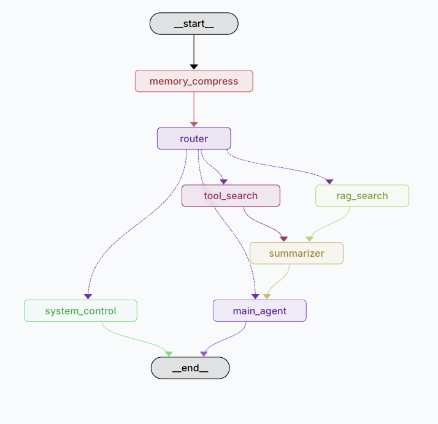

# QTrobot AI Assistant: A Decoupled Cyber-Physical Framework for Intelligent Social Robotics

This repository presents the advanced computational architecture designed for the QT social robot. The system employs a decoupled, asynchronous microservice paradigm to seamlessly integrate traditional robotic control (via ROS) with state-of-the-art Large Language Models (LLMs) and physiological signal processing. The resulting framework achieves a **bipartite intelligent architecture**, facilitating multimodal voice interaction, real-time global knowledge retrieval, localized specialized domain query resolution (via Retrieval-Augmented Generation), and high-frequency electrocardiogram (ECG) telemetry visualization, all synchronized with dynamic physical actuation.

---

## 1. System Architecture and Core Components

The framework is predicated upon a **Decoupled Asynchronous Architecture**, completely isolating high-latency cognitive computations from real-time hardware kinematics using ZeroMQ for inter-process communication (IPC) with minimal latency overhead:



### 1.1 Cognitive Processing Layer (Python 3.11 + LangGraph)
- **State-Driven Agentic Workflow**: Utilizes LangGraph to implement a deterministic state machine equipped with a semantic routing engine to accurately classify user natural language intent.
- **Dynamic Topographic Search**: Actuates the **Google Serper API** (implemented via `GoogleSerperAPIWrapper`) for real-time extraction of transient global information, functioning as a fallback heuristic when localized knowledge is insufficient.

### 1.2 Kinematic & Sensory Actuation Layer (Python 3.7 + ROS 1)
- **Acoustic Processing (NVIDIA Riva)**: Operates a real-time Automatic Speech Recognition (ASR) pipeline. It functions as a persistent environmental auditory listener, dispatching robust textual transcripts to the downstream cognitive layer.
- **Behavioral Dispatcher**: Computes JSON payloads originating from the cognitive layer (`Port 5556`) to articulate `/qt_robot/gesture/play`, audio synthesis, and facial expressions via native ROS Service calls, enabling synchronized multi-modal articulation.

### 1.3 Physiological Telemetry Interface (Python + HTML5/WebSockets)
- **High-Frequency ECG DSP Pipeline**: Interfaces with microcontrollers (e.g., ESP32 via SPI) to extract raw logic signals. Applies multistage digital signal processing (CIC, FIR, and bandpass superfilters) alongside fixed-point quantization for medical-grade waveform fidelity.
- **Asynchronous Clinical Visualization**: Deploys a lightweight WebSocket server streaming down-sampled vectors to a hardware-accelerated HTML5 Canvas dashboard, ensuring high-throughput, flicker-free rendering decoupled from the robotic core computations.

---

## 2. Repository Topology

```text
QT_ai_assistant/
│
├── ai/                      # Cognitive Processing Layer (Isolated Exec. Env: Python 3.11)
│   ├── document/            # Unstructured corpora (.txt) for the RAG embedding pipeline
│   ├── src/                 # Topological LangGraph definition and semantic routing logic
│   └── requirements.txt     # Specialized dependencies (Langchain, FAISS, ZMQ)
│
├── ros/                     # Kinematic Actuation Layer (Native ROS 1 / Python 3.7)
│   ├── config/              # ROS parameter YAML files for ASR and dispatcher tuning
│   ├── src/
│   │   ├── riva_speech_recongnition.py # Acoustic ingestion node
│   │   └── ros_behavior_dispatcher.py  # Spatial and affective articulation engine
│
├── ecg/                     # Physiological Telemetry Interface
│   ├── src/                 # DSP algorithms (Filter, Quantization, R-Peak Detection)
│   ├── web/                 # WebSocket Server (ecg_server.py) and Clinical Dashboard
│   └── requirements.txt     # Numeric computation dependencies (NumPy, SciPy)
│
├── scripts/                 # System orchestration and integration tests
│   ├── run.sh               # Main orchestrator utilizing asynchronous port polling
│   └── ...                  # Unit and integration test suites
│
└── README.md
```

---

## 3. Deployment Methodology

An automated orchestration script (`run.sh`) is provided to execute the distributed topology. It utilizes a polling heuristic to ensure strictly ordered, collision-free initialization of interdependent services.

### 3.1 Prerequisite Configuration
- Ensure the **NVIDIA Riva Core Server** daemon is active and systematically exposed on port `50051`.
- Instantiate virtual environments for isolated modules (`ai` and `ecg`) leveraging their respective `requirements.txt` manifests.
- Populate the `ai/document` directory with proprietary textual data to initialize the localized semantic vector space.

### 3.2 System Initialization
Execute the primary orchestration sequence:
```bash
./scripts/run.sh
```

To deploy the project from a laptop to the QTrobot body computer over SSH:
```bash
./scripts/deploy_to_robot.sh qtrobot@<robot-body-ip>
```

For a complete Traditional Chinese field setup guide covering Wi-Fi DHCP, SSH deployment, the YuGuard iOS Bluetooth bridge, Riva speech, and end-to-end verification, see:
[`docs/QTROBOT_SETUP_TUTORIAL_zh-TW.md`](docs/QTROBOT_SETUP_TUTORIAL_zh-TW.md).

The default remote target is `~/robot/code/tutorials/QT_ai_assistant`. The deploy script uses `rsync`, skips virtual environments, cache files, runtime outputs, git metadata, and local `.env` secrets by default, then creates `runtime/`, `logs/`, and a remote `config/ecg_integration.env` from the example when missing. Use `DEPLOY_DRY_RUN=true` to preview the upload first.

If the field machine cannot use `rsync` and you need an `scp`-based full upload that avoids local environment files, see:
[`docs/scp_deploy_without_env.md`](docs/scp_deploy_without_env.md).

ROS tuning parameters are loaded automatically from:
```text
ros/config/riva_speech_recognition.yaml
ros/config/dispatcher.yaml
```

For field testing, start by tuning `vad_confidence_threshold`, `consecutive_voice_chunks`, `pre_roll_seconds`, `min_voice_rms`, and `resume_cooldown`.

For changing a robot/Linux `eth0` interface from static IP to DHCP, see:
[`docs/eth0_dhcp_readme.md`](docs/eth0_dhcp_readme.md).

**Asynchronous Bootstrapping Sequence**:
1. **[0/6] ECG Integration Readiness**: Loads ECG configuration without starting a measurement. `ECG_MEASURE_ON_START=false` is the default so the assistant can remain running continuously.
2. **[1/6] Riva Core Verification**: Validates GPU allocation and confirms RPC port binding for the speech engine.
3. **[2/6] ROS Actuation Binding**: Instantiates the behavioral node, establishing a ZeroMQ subscriber socket on `5556`.
4. **[3/6] Face Memory Binding**: Subscribes to `/qt_nuitrack_app/faces` and maintains up to four short-term face slots in `runtime/face_memory.json`.
5. **[4/6] ASR Transceiver Initiation**: Activates continuous acoustic monitoring to intercept ambient vocalizations.
6. **[5/6] Cognitive Engine Deployment**: Compiles the LangGraph state machine and FAISS dense indices, opening publisher protocols on `5555`.

### 3.3 Bluetooth ECG Integration

Deployment values are configured in `config/ecg_integration.env`. Set `QT_FACE_HOST` to the IP address or hostname of the Raspberry Pi that drives QTrobot's face display. Passwordless SSH must be configured from the body computer to that host.

The canonical mobile bridge is the native iOS project at `../../../bluetooth/ecg_blooth`. The older `../../../bluetooth/ios-bridge` and root Node bridge are legacy implementations and must not be started together with the native app, because multiple writers would compete for the same Firebase command and stream paths.

The remote kiosk command is executed by `scripts/open_ecg_kiosk.sh` and is equivalent to:

```bash
export DISPLAY=:0
chromium-browser --disable-gpu --no-sandbox --kiosk --incognito "https://ecg-monitor-bf64d.web.app" &
```

The initial measurement stores BPM, RMSSD, pNN50, pRR30, pRR3.25%, SDNN, R-peak count, RR coefficient of variation, turning-point ratio, entropy features, premature-beat patterns, waveform summary, and signal quality. The screening layer labels regular, irregular, possible AF-like, frequent premature-beat, tachycardia, and bradycardia patterns. Results are written locally and to Firebase under `devices/yuguard_01/analysis`.

The measurement state progresses through `waiting_device`, `waiting_signal`, `measuring`, and the final analysis status. The 60-second timer does not begin when the start command is sent; it begins only after fresh ECG samples pass signal-quality, R-peak, and R-R interval checks. `ECG_SIGNAL_WAIT_TIMEOUT_SECONDS` controls how long the system waits for a stable ECG signal before returning `signal_timeout`. During formal measurement, `ECG_STREAM_GAP_TIMEOUT_SECONDS` returns `stream_lost` if the phone or BLE stream stops sending data.

For an ECG-only test without the AI/ROS dialogue pipeline, run `./scripts/test_ecg_standalone.sh`. It writes `command=reset`, clears the stream, writes `command=start`, waits for stable ECG quality, R peaks, and R-R intervals, then runs a short measurement. Set `ECG_TEST_DURATION=15` or `ECG_TEST_SIGNAL_WAIT_TIMEOUT=60` to tune the standalone test.

ECG measurement is conversation-triggered by default. Startup does not measure ECG unless `ECG_MEASURE_ON_START=true` is explicitly set. If `ECG_OPEN_DASHBOARD_ON_START=true`, the dashboard opens at boot without starting the 60-second measurement.

Face memory is a short-term slot tracker, not permanent biometric recognition. `ros/src/face_identity_memory.py` listens to Nuitrack's `/qt_nuitrack_app/faces` topic, maps the current `FaceInfo.id` to `person_1` through `person_4`, and evicts the least recently seen slot when a fifth new face appears. When an ECG measurement completes, the result is written back to the current slot. The AI therefore answers ECG-result questions from the current face slot first and refuses to reuse another person's ECG when no current face is visible.

Runtime debug output is intentionally visible in the terminal. Startup prints ECG, face-memory, face-camera, and AI debug configuration. `scripts/open_ecg_kiosk.sh` prints the target face Raspberry Pi, display, URL, and remote Chromium launch result. `face_identity_memory.py` prints the current person slot, Nuitrack tracking ID, face center/rectangle, visible slots, and known slot count. Adjust `FACE_MEMORY_DEBUG_LOG_INTERVAL` to control how often face status is printed.

To see what the robot camera sees during face testing, run `./scripts/open_face_camera_view.sh`. With a GUI display or SSH X forwarding it opens `rqt_image_view` or `image_view` on `/camera/color/image_raw`. From a remote laptop terminal without GUI forwarding, run `FACE_CAMERA_VIEWER=web ./scripts/open_face_camera_view.sh`; the script starts `web_video_server` when available and prints a browser URL for the camera stream.

AI terminal output is kept compact by default. `AI_TERMINAL_DEBUG=normal` prints received speech text, current status, latency, AI stage timing, final speech, expression, and motion. Use `AI_TERMINAL_DEBUG=quiet` to hide the AI stage timing, or `AI_LOG_LEVEL=INFO` only when deeper code logs are needed. `AI_LIBRARY_LOG_LEVEL=WARNING` keeps OpenAI/httpx/LangChain library logs from flooding the terminal.

The iOS app publishes each Firebase stream update as `{batch, session_id, sequence, sent_at_ms}`. The backend and dashboard also accept the legacy raw array format, but packet identity is preferred because it prevents Firebase reconnects from counting the retained packet twice.

During a conversation, requests such as "再測一次心電圖" or "measure ECG again" are routed deterministically to the `measureECG` system command. The ROS dispatcher opens the dashboard and launches a new ECG session in the background without blocking the AI dialogue process. Duplicate requests are ignored while a measurement process is still running.

The AI reloads this snapshot for every conversation turn and includes it only when relevant to ECG or medical questions. ECG output is limited to measured metrics, RR-based screening context, and the local YBC beat-level model under `model_arrhythmia`. The YBC output is not a calibrated disease probability and must not be presented as a diagnosis.

### 3.4 Dynamic Knowledge Ingestion Paradigm
The system integrates an auto-indexing FAISS mechanism designed for **hot-state initialization**. Upon executing `./scripts/run.sh`, the framework performs comprehensive traversal of `ai/document/**/*.txt`, executing robust tokenization and high-dimensional vector embeddings straight into volatile memory. This eliminates the necessity for manual retraining or explicit database migrations when updating the domain-specific corpus.

---

## 4. Third-Party Clinical DSP Module

The ECG signal processing pipeline depends on an external clinical DSP library:

### `ecg/src/SDM_DEMO_GUI/`

| Item | Description |
|---|---|
| **Source** | [https://github.com/YeJohn0417/SDM_DEMO_GUI/tree/main](https://github.com/YeJohn0417/SDM_DEMO_GUI/tree/main) |
| **Contents** | Real-time ECG filtering (`filter.py`), fixed-point quantization (`quant.py`), SPI hardware streaming (`spi_receive.py`), and arrhythmia analysis GUI |
| **Usage** | Provides the clinical-grade Pan-Tompkins DSP chain used by `ecg/src/web/ecg_server.py` |
| **Tracking** | **Excluded from this repository** (listed in `.gitignore`) — clone separately as shown below |

### Setup

```bash
# Clone the clinical DSP module into the expected location
git clone https://github.com/YeJohn0417/SDM_DEMO_GUI.git ecg/src/SDM_DEMO_GUI
```
